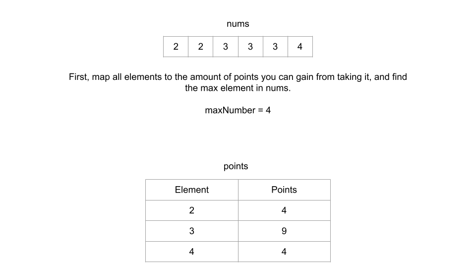
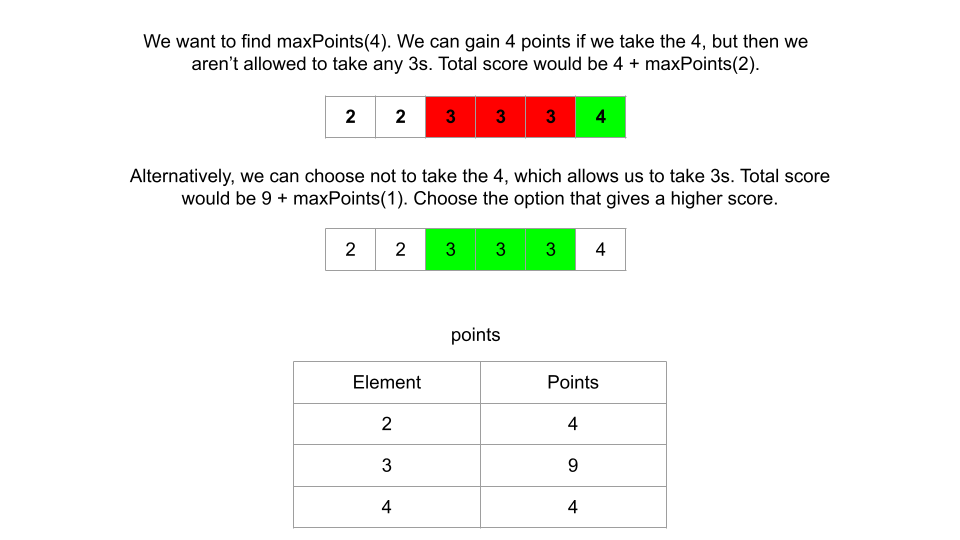
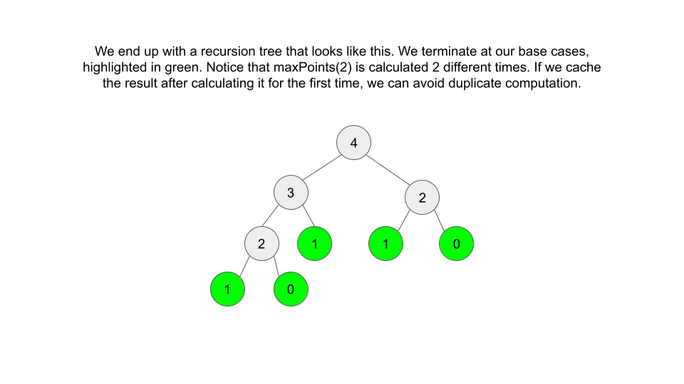
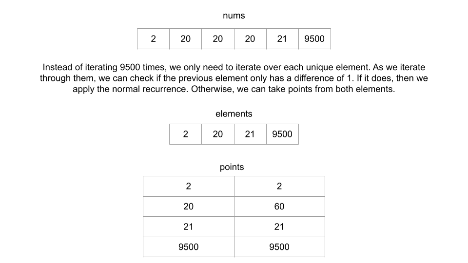

# 740 Delete and Earn Solution
## Overview
This problem is an excellent example of why it is important to read the problem description carefully. We can make a substantial optimization by noticing that the order of the elements in nums is irrelevant.

At any operation, we pick a number, let's say `x`, and delete all occurrences of `x - 1` and `x + 1`. That means if `x` occurs multiple times in nums and we take one, we may as well take all of them because after deleting all x - 1 and x + 1, we can only stand to gain more points by taking additional x.

Before we start, we can simplify nums by collecting all duplicate numbers together. As an example, nums can be represented as a hash map with numbers as keys which map to the number of times the key occurs in nums. [2, 2, 3, 3, 3, 4] would be converted to {2: 2, 3: 3, 4: 1}. Furthermore, since we are only really concerned about how many points each number can give us, we can multiply the keys and values to represent how many points taking the key will give us. In this case, we would have {2: 4, 3: 9, 4: 4}.

### In the first approach of this article, we will talk about an algorithm that solves this problem in detail. In the second approach, we will implement the same algorithm in a slightly more efficient way.

Then, we will look at some approaches that build on the idea from the first two approaches, but each one will have differences in their time and space complexities.

## Approach 1: Top-Down Dynamic Programming
### Intuition
There are two characteristics of this problem that hint towards the use of dynamic programming (DP). The first is that the problem is asking us to find the maximum of something. The second is that we need to make decisions on which numbers to take, and each decision may influence future decisions. For example, if we wanted to take all the fives, then we can no longer take the fours or sixes.

As described in the Dynamic Programming Explore Card, these two characteristics suggest that we should consider a DP solution. If you're new to DP, then reading this card is highly recommended.

The difficult part about this problem is figuring out how to always make the optimal decisions on which elements to take. Let's look at an example to illustrate the problem: nums = [5, 4, 5, 4, 3, 5, 3]. As we mentioned above, we can convert this into a format that's easier to use. We have two 3, two 4, and three 5. That means:

* If we take all the 3, we get 3 * 2 = 6 points.
* If we take all the 4, we get 4 * 2 = 8 points.
* If we take all the 5, we get 5 * 3 = 15 points.

If we tried moving from smaller keys to larger ones in a greedy manner, our first decision would be to take all 3 or all 4. We can only choose one because picking one deletes the other one. Well, we get 8 points if we pick 4 and 6 points if we pick 3, so perhaps we should greedily pick 4. Unfortunately, this prevents us from picking 5, which gives us way more points.

Perhaps a different greedy strategy would work. How about sorting the keys by how many points they give, and then greedily trying to pick the most points? That way, we would take the 15 points here immediately. Well, what if we had an example nums = [5, 5, 5, 6, 6, 6, 6, 7, 7]? We would have:

* 5 --> 15 points.
* 6 --> 24 points.
* 7 --> 14 points.

Again, this greedy strategy won't work. Those 24 points are tempting, but by taking them, we delete 29 points. In these small examples, it's easy to see what the correct decisions are. But for larger test cases, the question can get out of hand quickly. We need to ensure that we always make the correct decision.

This is where DP comes in. We'll skip over the underlying details of DP, so the article stays focused on the problem - but if DP is relatively new to you, then you will likely find the DP explore card to be a very helpful resource.

We can formulate DP algorithms in 3 easy steps. First, we need some sort of memory that stores the answer to our question. Because we're doing top-down, we'll use a hash table for memory and a recursive function. Let's declare a function maxPoints. We want maxPoints(num) to return the maximum points that we can gain if we only consider all the elements in nums with values between 0 and num.


The second thing we need is a recurrence relation, a way to move between states. Let's say that we are currently at some arbitrary number x, where x is in nums one or more times. How can we find maxPoints(x)? When it comes to x, we have to make a choice: take, or don't take.

    *   If we take x, then we gain points equal to x times the number of times x occurs in nums - we can pre-compute these values. For now, let's call this value gain. However, because of the deletion, by taking x, we are no longer allowed to take x - 1. The largest number that we can still consider is x - 2. Therefore, if we choose to take x, then the most points that we can have here is gain + maxPoints(x - 2), where gain is how many points we gain from taking x and maxPoints(x - 2) is the maximum number of points we can obtain from the numbers between x - 2 and 0.

    *   If we choose not to take x, then we don't gain any points here, but we still may have accumulated some points from numbers smaller than x. Because we didn't take x, we did not close the door to x - 1. In this case, the most points we can have here is maxPoints(x - 1).

This forms our recurrence relation: for an arbitrary x, maxPoints(x) = max(maxPoints(x - 1), maxPoints(x - 2) + gain), where gain is the number of points we can gain from taking x.

```
The problem is, even though we figured out how to find maxPoints(x), how do we find maxPoints(x - 1) and maxPoints(x - 2)? That would involve finding maxPoints(x - 3) and maxPoints(x - 4) and so on.
```

The third component of a dynamic programming solution is base cases. Typically, we can find base cases with a little bit of logical thinking. First, maxPoints(0) will always be equal to 0. Second, when considering maxPoints(1), we only care about the elements 0 and 1. We do not care about 2 because of how we defined maxPoints(x). Looking at the recurrence relation, we know that if we arrived at 1, it means that we must not have taken 2, and because 1 times any quantity will be greater than or equal to the number of points we can get from taking 0, we should always take 1 (if there are any).

With these base cases, we can find maxPoints(2). With maxPoints(2) calculated, we can find maxPoints(3), all the way up to maxPoints(max(nums)). Remember, we defined maxPoints(x) as the maximum points we can gain when we consider the numbers from 0 to x, so maxPoints(max(nums)) covers the entire input, and stores the answer to the original problem.

```
Because each call to maxPoints will create 2 extra calls (the recurrence relation looks for maxPoints(num - 1) and maxPoints(num - 2)), we would end up with an exponential amount of function calls. To avoid this, we will memoize our function. When we find the answer for a certain number for the first time, we will store this answer. Then in the future, we can refer to this value instead of repeating computation.
```





## Algorithm
1. Declare a hash table points that will map elements to the number of points that we can gain from taking each element. Also, declare a hash map cache that we will use to memoize our recursive function.

2. Loop through nums once to populate points to find maxNumber, which is the largest element in nums.

3. Initialize a function maxPoints, where maxPoints(num) will return the maximum amount of points we can gain if we only consider numbers from 0 to num.

4. In maxPoints, first check for the base cases. If num == 0, return 0. If num == 1, return points[1]. Otherwise, check if num is already in cache. If it is, just return cache[num].

5. Otherwise, apply the recurrence relation. Find the answer for num with max(maxPoints(num - 1), maxPoints(num - 2) + points[num]). Store this answer in cache, and then return it.

6. Return maxPoints(maxNumber).


## Implementation
```java
class Solution {
    private HashMap<Integer, Integer> points = new HashMap<>();
    private HashMap<Integer, Integer> cache = new HashMap<>();
    
    private int maxPoints(int num) {
        // Check for base cases
        if (num == 0) {
            return 0;
        }
        
        if (num == 1) {
            return points.getOrDefault(1, 0);
        }
        
        if (cache.containsKey(num)) {
            return cache.get(num);
        }
        
        // Apply recurrence relation
        int gain = points.getOrDefault(num, 0);
        cache.put(num, Math.max(maxPoints(num - 1), maxPoints(num - 2) + gain));
        return cache.get(num);
    }
    
    public int deleteAndEarn(int[] nums) {
        int maxNumber = 0;
        
        // Precompute how many points we gain from taking an element
        for (int num : nums) {
            points.put(num, points.getOrDefault(num, 0) + num);
            maxNumber = Math.max(maxNumber, num);
        }
        
        return maxPoints(maxNumber);
    }
}
```

## Complexity Analysis

Given NN as the length of nums and kk as the maximum element in nums,

* Time complexity: O(N + k)O(N+k)

To populate points, we need to iterate through nums once, which costs O(N)O(N) time. Then, we call maxPoints(maxNumber). This call will repeatedly call maxPoints until we get down to our base cases. Because of cache, already solved sub-problems will only cost O(1)O(1) time. Since maxNumber = k, we will solve k unique sub-problems so, this recursion will cost O(k)O(k) time. Our final time complexity is O(N + k)O(N+k).

* Space complexity: O(N + k)O(N+k)

The extra space we use is the hash table points, the recursion call stack needed to find maxPoints(maxNumber), and the hash table cache.

The size of points is equal to the number of unique elements in nums. In the worst case, where every element in nums is unique, this will take O(N)O(N) space. The recursion call stack will also grow up to size k, since we start our recursion at maxNumber, and we don't start returning values until our base cases at 0 and 1. Lastly, cache will store the answer for all states, from 2 to maxNumber, which means it also grows up to k size. Our final space complexity is O(N + 2 \cdot k)O(N+2⋅k) = O(N + k)O(N+k).

## Approach 2: Bottom-Up Dynamic Programming
### Intuition

In the top-down approach, we start at the "top" (maxNumber), and move towards our base cases (maxPoints[0] = 0, maxPoints[1] = nums.count(1)). With bottom-up, we will start at the base cases and iterate away from them towards the result we want (maxNumber).

For this approach, instead of having maxPoints be a recursive function, we will have it be an array where maxPoints[num] stores the maximum points we can gain if we consider only numbers from 0 to num. As you can see, this is just a different way to format maxPoints, but in terms of functionality, it will be the same as the previous approach.

### Algorithm

1. Declare a hash table points that will map elements to the amount of points that we can gain from taking each element.

2. Loop through nums once to populate points and find the largest element in nums, maxNumber.

3. Initialize an array maxPoints of size maxNumber + 1, where maxPoints[num] will store the maximum amount of points we can gain if we only considered numbers from 0 to num (inclusive). Set all the values to 0 initially, except for maxPoints[1] - it should be set to points[1] (our base case).

4. Iterate from 2 to maxNumber. At each iteration, apply the recurrence relation maxPoints[num] = max(maxPoints[num - 1], maxPoints[num - 2] + points[num]) to populate maxPoints.

5. At the end, return maxPoints[maxNumber].

### Implementation
```java
class Solution {
    public int deleteAndEarn(int[] nums) {
        HashMap<Integer, Integer> points = new HashMap<>();
        int maxNumber = 0;
        
        // Precompute how many points we gain from taking an element
        for (int num : nums) {
            points.put(num, points.getOrDefault(num, 0) + num);
            maxNumber = Math.max(maxNumber, num);
        }
        
        // Declare our array along with base cases
        int[] maxPoints = new int[maxNumber + 1];
        maxPoints[1] = points.getOrDefault(1, 0);
        
        for (int num = 2; num < maxPoints.length; num++) {
            // Apply recurrence relation
            int gain = points.getOrDefault(num, 0);
            maxPoints[num] = Math.max(maxPoints[num - 1], maxPoints[num - 2] + gain);
        }
        
        return maxPoints[maxNumber];
    }
}
```
### Complexity Analysis

Given NN as the length of nums and kk as the maximum element in nums,

* Time complexity: O(N + k)O(N+k)

To populate points, we need to iterate through nums once, which costs O(N)O(N) time. Then, we populate maxPoints by iterating over it. The length of maxPoints is equal to k + 1, so this will cost O(k)O(k) time. Our final time complexity is O(N + k)O(N+k).

* Space complexity: O(N + k)O(N+k)

The extra space we use is the hash table points and our DP array maxPoints. The size of maxPoints is equal to k + 1, which means it takes O(k)O(k) space. The size of points is equal to the number of unique elements in nums. In the worst case, where every element in nums is unique, this will take O(N)O(N) space. Our final space complexity is O(N + k)O(N+k).

## Approach 3: Space Optimized Bottom-Up Dynamic Programming
### Intuition

In our recurrence relation, for a given num, we refer to num - 1 and num - 2. To find maxPoints[10], we only need maxPoints[9] and maxPoints[8]. While it is true that we also need to calculate maxPoints for 0 to 7, by the time we get to 10, we don't need those values anymore. Because of this, instead of using an array to store the answers to all states, we can improve to constant space by only storing the previous two values.

Let's use two integer variables, twoBack and oneBack, that at any given num will represent maxPoints[num - 2] and maxPoints[num - 1] respectively. In the second approach, we started iterating from 2. This means that twoBack should be initialized the same as maxPoints[0] = 0, and oneBack should be initialized the same as maxPoints[1] = nums.count(1).

Our recurrence relation remains the same, as long as we appropriately substitute the variables. Now, it is maxPoints[num] = max(oneBack, twoBack + points[num]). Once we calculate this value, we need to update twoBack and oneBack. When we go to the next number, the previous value (oneBack) will become twoBack, and the current value will become oneBack. At the very end, oneBack will be our answer.

### Algorithm

1. Declare a hash table points that will map elements to the amount of points that we can gain from taking each element.

2. Loop through nums once to populate points to find maxNumber, which is the largest element in nums.

3. Initialize twoBack = 0 and oneBack = points[1]. These are the base cases from the previous approaches.

4. Loop from 2 to maxNumber. At each iteration num, update oneBack and twoBack. oneBack should be updated according to the recurrence relation - max(oneBack, twoBack + points[num]). twoBack should be updated to what oneBack was before applying the recurrence relation. This way, when we get to the next number, one step back will become two steps back, and the current step will become the previous step.

5. Return oneBack.

### Implementation
```java
class Solution {
    public int deleteAndEarn(int[] nums) {
        int maxNumber = 0;
        HashMap<Integer, Integer> points = new HashMap<>();
        
        // Precompute how many points we gain from taking an element
        for (int num : nums) {
            points.put(num, points.getOrDefault(num, 0) + num);
            maxNumber = Math.max(maxNumber, num);
        }
        
        // Base cases
        int twoBack = 0;
        int oneBack = points.getOrDefault(1, 0);
        
        for (int num = 2; num <= maxNumber; num++) {
            int temp = oneBack;
            oneBack = Math.max(oneBack, twoBack + points.getOrDefault(num, 0));
            twoBack = temp;
        }
        
        return oneBack;
    }
}
```
### Complexity Analysis

Given NN as the length of nums and kk as the maximum element in nums,

* Time complexity: O(N + k)O(N+k)

To populate points, we need to iterate through nums once, which costs O(N)O(N) time. Then, we iterate from 2 to k, doing O(1)O(1) work at each iteration, so this will cost O(k)O(k) time. Our final time complexity is O(N + k)O(N+k).

* Space complexity: O(N)O(N)

The extra space we use is the hash table points.

The size of points is equal to the number of unique elements in nums. In the worst case, where every element in nums is unique, this will take O(N)O(N) space.

Unlike in approach 2, we no longer need an array maxPoints which would be of size k. Thus, we have improved the space complexity to O(N)O(N).

## Approach 4: Iterate Over Elements
### Intuition

In the previous three approaches, we found the maximum element in nums, and iterated from 0 to maxNumber. The problem with this idea is that in some test cases, there could be large gaps between elements that we will waste time iterating over. In all three approaches, our time complexity was O(N + k)O(N+k), or O(\text{nums.length} + \text{max(nums)})O(nums.length+max(nums)). This is very inefficient for a case such as nums = [1, 2, 3, 10000].

Instead of iterating over all numbers from 0 to max(nums), we can iterate over only the elements that appear in nums. Unfortunately, we will need to perform a sort to do this, but in cases like nums = [1, 2, 3, 10000], the algorithm will run much faster.

Let's use the same logic from the previous approaches to create a hash map points that keeps track of how many points we gain from taking elements. Once we have points, we can sort the keys in ascending order. These keys will be what we iterate over.

If we find that adjacent elements have a difference of 1, that means we can only take the points associated with one of them, and we need to use the same recurrence relation as in the previous approach (oneBack = max(oneBack, twoBack + points[num])). However, if two elements do not differ by 1, then that means we don't need to worry about deletions, and we should always take the points. In this case, we just add points[num] to oneBack.



### Algorithm

1. Declare a hash table points that will map elements to the amount of points that we can gain from taking each element.

2. Loop through nums once to populate points.

3. Create a list elements that holds the keys of points in ascending order.

4. Initialize twoBack = 0 and oneBack = points[elements[0]]. These are the base cases.

5. Iterate through elements, starting from index 1. At each currentElement, compare the element number with the previous element's number.

6. If they differ by 1, then we need to apply the normal recurrence relation oneBack = max(oneBack, twoBack + points[currentElement].
If they don't, then it is always beneficial to take the points. Do oneBack += points[currentElement].
In either case, we need to update twoBack to what oneBack was before it was updated.
7. Return oneBack.

### Implementation
```java
class Solution {
    public int deleteAndEarn(int[] nums) {
        int maxNumber = 0;
        HashMap<Integer, Integer> points = new HashMap<>();
        
        // Precompute how many points we gain from taking an element
        for (int num : nums) {
            points.put(num, points.getOrDefault(num, 0) + num);
            maxNumber = Math.max(maxNumber, num);
        }
        
        List<Integer> elements = new ArrayList<Integer>(points.keySet());
        Collections.sort(elements);
        
        // Base cases
        int twoBack = 0;
        int oneBack = points.get(elements.get(0));
        
        for (int i = 1; i < elements.size(); i++) {
            int currentElement = elements.get(i);
            int temp = oneBack;
            if (currentElement == elements.get(i - 1) + 1) {
                // The 2 elements are adjacent, cannot take both - apply normal recurrence
                oneBack = Math.max(oneBack, twoBack + points.get(currentElement));
            } else {
                // Otherwise, we don't need to worry about adjacent deletions
                oneBack += points.get(currentElement);
            }

            twoBack = temp;
        }
        
        return oneBack;
    }
}
```

### Complexity Analysis

Given NN as the length of nums,

* Time complexity: O(N \cdot log(N))O(N⋅log(N))

To populate points, we need to iterate through nums once, which costs O(N)O(N) time.

Next, we take all the keys of points and sort them to create elements. In the worst case when nums only contains unique elements, there will be N keys, which means this will cost O(N \cdot log(N))O(N⋅log(N)) time.

Lastly, we iterate through elements, which again in the worst case costs O(N)O(N) time when all the elements are unique.

This gives us a time complexity of O(N + N \cdot log(N) + N) = O(N \cdot log(N))O(N+N⋅log(N)+N)=O(N⋅log(N)).

* Space complexity: O(N)O(N)

The extra space we use is the hash table points and elements. These have the same length, and in the worst case scenario when nums only contains unique elements, their lengths will be equal to N.

