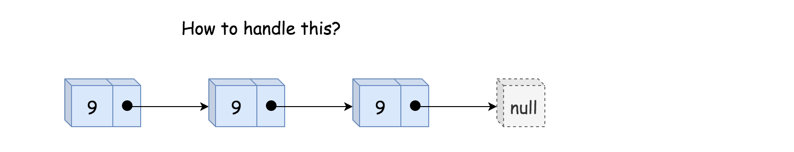
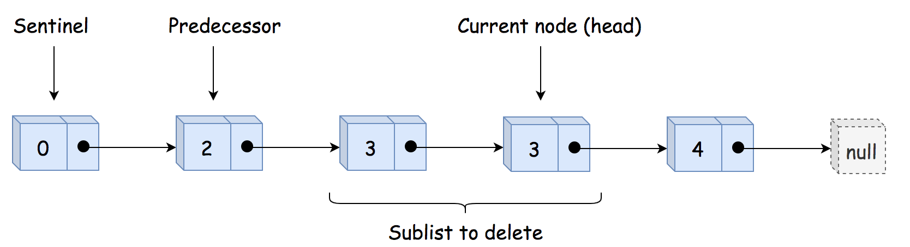
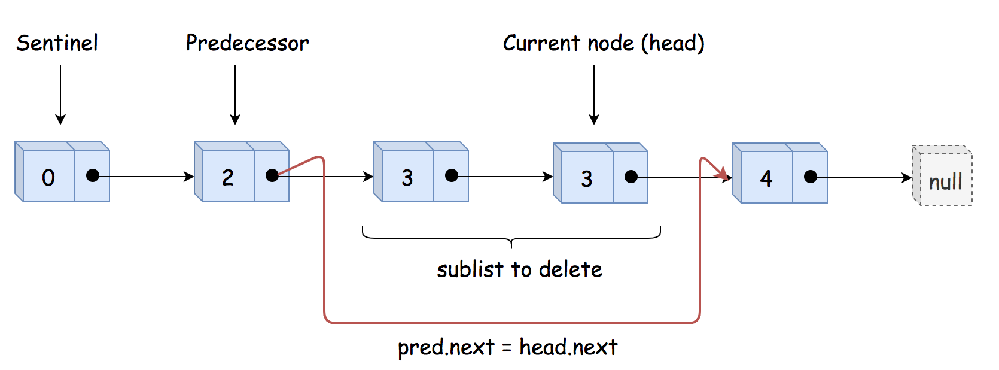

# Solution
## Approach 1: Sentinel Head + Predecessor

## Sentinel Head

Let's start from the most challenging situation: the list head is to be removed.



The standard way to handle this use case is to use the so-called Sentinel Node. Sentinel nodes are widely used for trees and linked lists as pseudo-heads, pseudo-tails, etc. They are purely functional and usually don't hold any data. Their primary purpose is to standardize the situation to avoid edge case handling.

For example, let's use here pseudo-head with zero value to ensure that the situation "delete the list head" could never happen, and all nodes to delete are "inside" the list.

## Delete Internal Nodes

The input list is sorted, and we can determine if a node is a duplicate by comparing its value to the node after it in the list. Step by step, we could identify the current sublist of duplicates.

Now it's time to delete it using pointer manipulations. Note that the first node in the duplicates sublist should be removed as well. That means that we have to track the predecessor of duplicates sublist, i.e., the last node before the sublist of duplicates.



Having predecessor, we skip the entire duplicate sublist and make predecessor to point to the node after the sublist.



## Implementation
```java
class Solution {
    public ListNode deleteDuplicates(ListNode head) {
        // sentinel
        ListNode sentinel = new ListNode(0, head);

        // predecessor = the last node 
        // before the sublist of duplicates
        ListNode pred = sentinel;
        
        while (head != null) {
            // if it's a beginning of duplicates sublist 
            // skip all duplicates
            if (head.next != null && head.val == head.next.val) {
                // move till the end of duplicates sublist
                while (head.next != null && head.val == head.next.val) {
                    head = head.next;    
                }
                // skip all duplicates
                pred.next = head.next;     
            // otherwise, move predecessor
            } else {
                pred = pred.next;    
            }
                
            // move forward
            head = head.next;    
        }  
        return sentinel.next;
    }
}
```