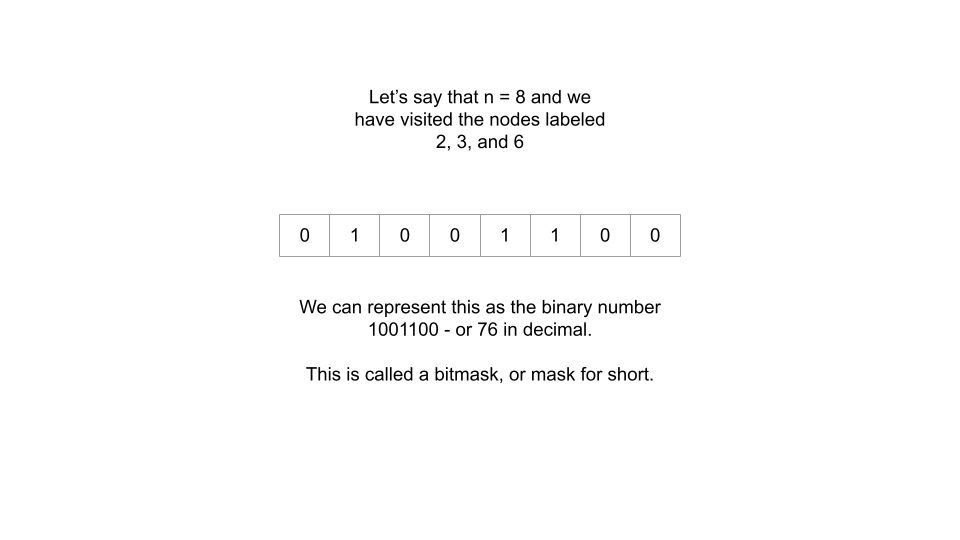
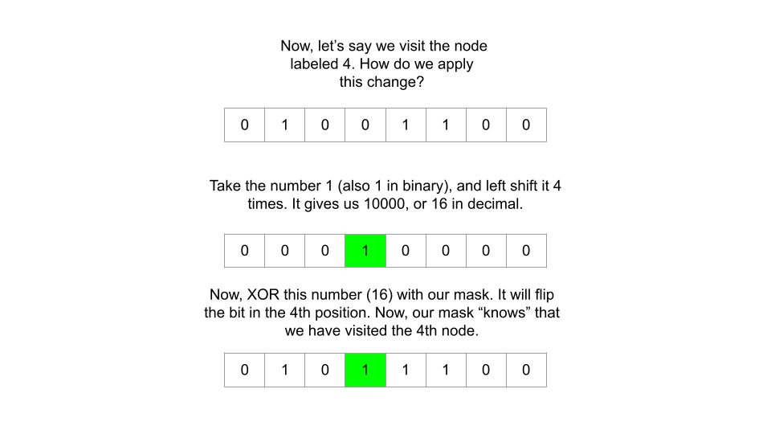
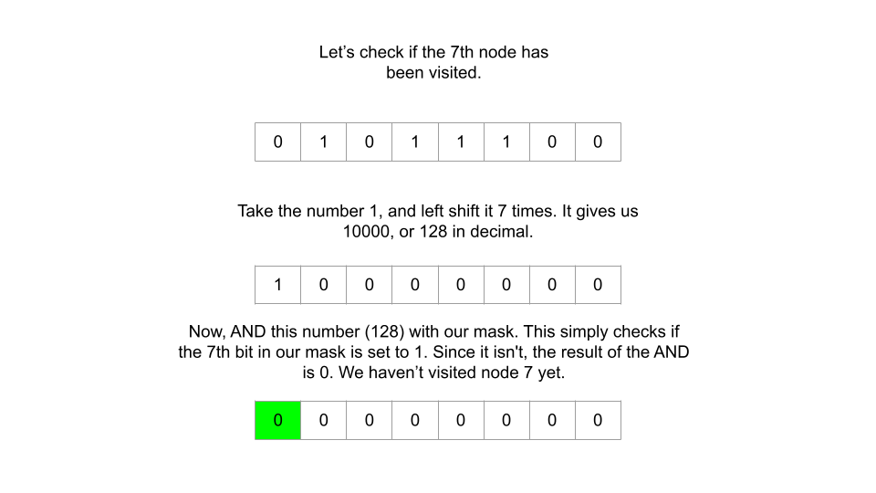

# Solution
## Approach 1: DFS + Memoization (Top-Down DP)
# Overview

For those who have read the Dynamic Programming explore card, you may notice that this problem has two of the main characteristics of a problem that can be solved with dynamic programming. First, it's asking for the shortest path, and second, the answer depends on decisions we make as we go through the graph. For example, the answer to the question, "at each node, which edge should we take" depends on which nodes we have already visited.

It's always important to look at a problem's constraints (or ask the interviewer if the problem constraints are known) before thinking about a solution. In this problem, we have n <= 12. Such a small constraint tells us that we can likely just explore all possibilities. A good way to do this is with recursion (DFS here) and some caching to avoid repeated computation, in other words, top-down dynamic programming.

What defines a state? If we picture this scenario in real life, what information do we need at any given moment? First, we clearly need to know what node we are currently at. Second, we need to know which nodes we have already visited. Since the problem states that we can revisit nodes and reuse edges, these two pieces of information are all that we need. How do we keep track of nodes we have visited so far? An array could work, but the problem is that we need to cache states to avoid repeating computation, and as arrays are mutable, they cannot be put in hash tables as keys. Is there a better way to encode the nodes we have visited so far?

Bit Manipulation To Encode State

We can use bitmasks, which is a great tool to learn as many other problems can be solved more efficiently by using them. If there are n nodes, then there are 2^n2 
n
  possible states of nodes we have visited so far - for each node, we have either visited it or we haven't. Therefore, we can use an integer to represent the nodes that we have visited so far - if the i^{th}i 
th
  bit of the integer (from the right side) is set to 1, then that means we have visited node i.



```
In this section of the explanation, numbers are 0 indexed. So "4^{th}4 
th
  bit" will refer to the fifth bit from the right, and "0^{th}0 
th
  bit" will refer to the rightmost bit. Similarly, the "6^{th}6 
th
  node" will refer to the node with label 6.
```

While this is an easy and very efficient way to encode state, we also need to know how to do 2 things:

How to change the mask (flip certain bits, for example, if we visit the 6th node, how do we flip the 6th bit?)

How to tell what nodes we have visited so far (given a certain mask, how do we tell if we have visited the 4th node?)

To change the mask through flipping bits, we can start by taking the number 1. If we left shift 1 i times, then we will end up with a binary number that only has a 1 in the i^{th}i 
th
  position. For example, 1 << 4 equals 16, or '10000' in binary, which is just a 1 in the 4th position. We can then XOR this number with our mask. Because 1 XOR 1 = 0 and 1 XOR 0 = 1, this would flip the bit in the 4th position of our mask.



Now, given a mask, how do we tell if a certain node has been visited? We can use the exact same process as above - let's say we wanted to check if the 7th node has been visited. Take the number 1, and left shift it 7 times. 1 << 7 equals 128, or 10000000 in binary. Now, instead of performing an XOR, perform an AND. If the mask has the 7th bit set to 1, then the AND will just give us back the same number, 128. If the mask has the 7th bit set to 0, then the AND will give us back 0. Thus, if the result of the AND equals 0, then we know the node has not been visited yet.




## Intuition

Now that we have an efficient method for tracking which nodes have been visited, how do we solve the problem? Let's define a state as (node, mask), where node represents the label of the current node we are at, and mask represents a bitmask where all the nodes we have visited have their respective bits set to 1.

From any given state, what other states can we transition to? Of course, we can only move to a node if an edge exists - let's call those nodes "neighbors". So from our current node, we can move to any neighbor. What about mask? As we begin to formulate our recurrence relation, let's think in the backward direction.

Let's say that we are currently at node 1 and came from node 0. When we were at node 0, before going to 1, there were two possibilities: either we had already visited node 1 some time earlier (such as in the case of 1 --> 0 --> 1), or we are visiting node 1 for the first time (maybe we start at node 0 and go 0 --> 1).

In the first scenario (already visited), our bitmask mask would not have changed. If we are at node 1 and came from node 0, with the overall path being 1 --> 0 --> 1, then before traversing back to 1, our mask would have already been 11. Since we are visiting node 1 for the second time, the mask doesn't change - the bit at position 1 being set to 1 means we have already visited this node.

However, in the second scenario (visiting for the first time), our bitmask mask will change. Let's say we start at node 0 and move to node 1. After the move, our bitmask would be equal to 11, since we have now visited both nodes. However, before the move, our bitmask was 01. Since our path is just 0 --> 1, we are visiting node 1 for the first time.

Therefore, for any given state (node, mask), we can visit all neighbors of node, and for each neighbor, we can have mask remain unchanged, or have mask after flipping the bit at position node (if we're at node 2, then flip the bit in position 2). We should look at all options and choose the best one. Since each movement counts as a "step", we also need to add 1 to the best option. More formally, our recurrence is:

dp(node, mask) = 1 + min(dp(neighbor, mask), dp(neighbor, mask ^ (1 << node))), for all neighbors in graph[node].

The mask ^ (1 << node) operation is flipping the bit at position node using the method talked about before, to indicate that we are visiting this node for the first time.

You may notice that this recurrence will cause infinite cycles, because the graph is undirected. For example, if node A and node B share an edge, then (A, mask) and (B, mask) would bounce between each other infinitely. When we implement the algorithm, we can get around these cycles by caching a state's value as infinity (since the problem is asking for a minimum) the first time we visit it, and before we traverse to any other states. This ensures that if we go from (A, mask) to (B, mask) we cannot return to A until we have visited at least one new node (thus changing mask).

Now that we have our recurrence relation, we can solve this problem using DFS. But first, we must decide what our base case will be. A base case is any state where we can calculate the result without making recursive calls. In this problem, the base case could be when we have visited all nodes, return 0 because we have visited all nodes and no more steps need to be made, or the base case could be when there is only 1 unvisited node, return 0 because we have visited all other nodes and we must be standing on the final node.

Here, since we are thinking in the backward direction, we will choose the latter option. Thus, we will start our DFS at the "top", i.e. all nodes already being visited. This means that our mask should have all bits set to 1 - if there are 5 nodes, we should start with mask = 31 (11111 in binary). Let's call this mask the endingMask - and we can easily find it with the formula (1 << n) - 1 where n is the number of nodes. This formula works because we are shifting a single bit to the left n times, which in the case of n = 5 gives us 100000, which after subtracting 1 will leave 5 bits set to 1, i.e. 100000 - 000001 = 011111.

That means when we start our DFS at (node, endingMask), we are actually at the end of a path that visited all nodes (since endingMask indicates that we have visited all nodes). With top-down, we work towards the base cases - what are the base cases here? Well, the problem states we can start at any node. Therefore, any time a state has a mask with only a single bit set to 1, we know that this is a starting position, because by starting at a node we have already "visited" it, and it is the only node we have visited.

There are multiple ways to check if a mask has only one bit set to 1, such as checking if it is a power of 2. For this problem, we will use the neat trick (mask & (mask - 1) == 0), often referred to as Brian Kernighan's method. The operation mask & (mask - 1) sets the least significant bit (the right-most '1') to zero, so this condition is only true when only one bit is set to 1. This is because, in those cases, mask is in the form of 100...000, and mask - 1 in binary is 0111...111. The AND of these two numbers will be 0 as there are no positions where both bits are set to 1.

Because the optimal path may end at any of the nodes (we don't know for sure unless we check), we will need to perform a DFS for each node. Subsequent searches will not be too expensive as we will maintain our cache throughout.

## Algorithm

Initialize some variables.

n, as the length of graph.
endingMask = (1 << n) - 1, a bitmask that represents all nodes being visited.
For example, if n = 5, then endingMask = 31 = '11111'.
cache, a data structure that will be used to cache results to prevent duplicate computation.
Create a function dp(node, mask) that will be used for DFS.

First, check if this state has already been visited. If it has, return the cached result.
If not, check for the base case. If (mask & (mask - 1)) == 0, then we have visited all other nodes, return 0.
Otherwise, add an entry into the cache for this state with a very large number like infinity. We need to do this before applying the recurrence relation to avoid the infinite cycles we talked about above.
Now, apply the recurrence relation. For all neighbor in graph[node], explore both mask options: already visited (dp(neighbor, mask)) or visiting for the first time (dp(neighbor, mask ^ (1 << node))). Choose the best option out of all adjacent states, add 1 to it, and update the entry in the cache for the current state.
At the end of the recurrence application, just return the result for the current state stored in the cache.
Perform a DFS for each node - dp(node, endingMask) for all node from 0 to n - 1. Pick the lowest result and return it.

## Implementation

```java

class Solution {
    private int[][] cache;
    private int endingMask;
    
    public int dp(int node, int mask, int[][] graph) {
        if (cache[node][mask] != 0) {
            return cache[node][mask];
        }
        if ((mask & (mask - 1)) == 0) {
            // Base case - mask only has a single "1", which means
            // that only one node has been visited (the current node)
            return 0;
        }
        
        cache[node][mask] = Integer.MAX_VALUE - 1; // Avoid infinite loop in recursion
        for (int neighbor: graph[node]) {
            if ((mask & (1 << neighbor)) != 0) {
                int alreadyVisited = dp(neighbor, mask, graph);
                int notVisited = dp(neighbor, mask ^ (1 << node), graph);
                int betterOption = Math.min(alreadyVisited, notVisited);
                cache[node][mask] = Math.min(cache[node][mask], 1 + betterOption);
            }
        }
        
        return cache[node][mask];
    }
    
    public int shortestPathLength(int[][] graph) {
        int n = graph.length;
        endingMask = (1 << n) - 1;
        cache = new int[n + 1][endingMask + 1];
        
        int best = Integer.MAX_VALUE;
        for (int node = 0; node < n; node++) {
            best = Math.min(best, dp(node, endingMask, graph));
        }
        
        return best;
    }
}

```

# Approach 2: Breadth-First Search (BFS)
## Intuition

The previous approach is comparatively slow but works because the bounds are small. The main problem is that we are working backwards and need a DFS starting from every node. The optimal path may end at node 0, but we still need to check all other nodes to make sure. As with any problem that asks us to find the shortest path, it may be more intuitive to approach this problem using BFS.

Because BFS guarantees the shortest path in an unweighted graph, as soon as we find an answer, we know it is the optimal one, unlike in the previous solution where we needed to explore all reachable states to make sure.

This approach is similar to the previous one in terms of logic. However, instead of using top-down dynamic programming in the form of DFS + memoization, we will perform BFS by implementing a queue. Instead of starting at endingMask, we will start at the base case masks - only having one bit set to 1, and then work our way towards endingMask.

Because we were working backwards in the previous approach, for all neighbors, we needed to check (neighbor, mask) and (neighbor, mask ^ (1 << node)). Now, since we're moving forwards, the state we should consider next from each (node, mask) is different. If we are at node A and move to node B, it doesn't matter if we go B -> A -> B or A -> B - in both cases, upon arriving at B, we want our mask to have the bit corresponding to node B set as 1. This is a nice improvement on the previous approach as for each neighbor, we only need to consider 1 possibility instead of 2. Since we always want the bit to be set to 1, we will use an OR operation with 1 << neighbor to make sure the bit is set to 1.

More formally, for any given state (node, mask), we can traverse to (neighbor, mask | (1 << neighbor)) for all neighbors in graph[node]. We will still need to use some space to ensure that we don't revisit states and create an infinite cycle, but this time we don't need to associate the states with any values, just a flag to indicate if it has been visited yet or not.

## Algorithm

If graph only contains one node, then return 0 as we can start at node 0 and complete the problem without taking any steps.

Initialize some variables:

n, as the length of graph.
endingMask = (1 << n) - 1, a bitmask that represents all nodes being visited.
seen, a data structure that will be used to indicate if we have visited a state to prevent cycles.
queue, a data structure that implements an abstract queue used for our BFS.
steps, an integer that keeps track of which step we are on. Since BFS gaurantees a shortest path, as soon as we encounter endingMask, we can return steps.
Populate queue and seen with the base cases (starting at all nodes with the mask set to having only visited the given node). This is (i, 1 << i) for all i from 0 to n - 1.

Perform a BFS:

Initialize nextQueue, which will replace queue at the end of the current step.
Loop through the current queue. For each state (node, mask), loop through graph[node]. For each neighbor, declare a new state (neighbor, nextMask), where nextMask = mask | (1 << neighbor). If nextMask == endingMask, then that means taking one more step to the neighbor will complete visiting all nodes, so return 1 + steps. Otherwise, if this new state has not yet been visited, then add it nextQueue and seen.
After looping through the current queue, increment steps by 1 and replace queue with nextQueue.
The constraints state that the input graph is always connected, therefore there will always be an answer. The return statement in the BFS will always trigger, and we don't need to worry about other cases.

## Implementation
```java
class Solution {
    public int shortestPathLength(int[][] graph) {
        if (graph.length == 1) {
            return 0;
        }
        
        int n = graph.length;
        int endingMask = (1 << n) - 1;
        boolean[][] seen = new boolean[n][endingMask];
        ArrayList<int[]> queue = new ArrayList<>();
        
        for (int i = 0; i < n; i++) {
            queue.add(new int[] {i, 1 << i});
            seen[i][1 << i] = true;
        }
        
        int steps = 0;
        while (!queue.isEmpty()) {
            ArrayList<int[]> nextQueue = new ArrayList<>();
            for (int i = 0; i < queue.size(); i++) {
                int[] currentPair = queue.get(i);
                int node = currentPair[0];
                int mask = currentPair[1];
                for (int neighbor : graph[node]) {
                    int nextMask = mask | (1 << neighbor);
                    if (nextMask == endingMask) {
                        return 1 + steps;
                    }
                    
                    if (!seen[neighbor][nextMask]) {
                        seen[neighbor][nextMask] = true;
                        nextQueue.add(new int[] {neighbor, nextMask});
                    }
                }
            }
            steps++;
            queue = nextQueue;
        }
        
        return -1;
    }
}
```